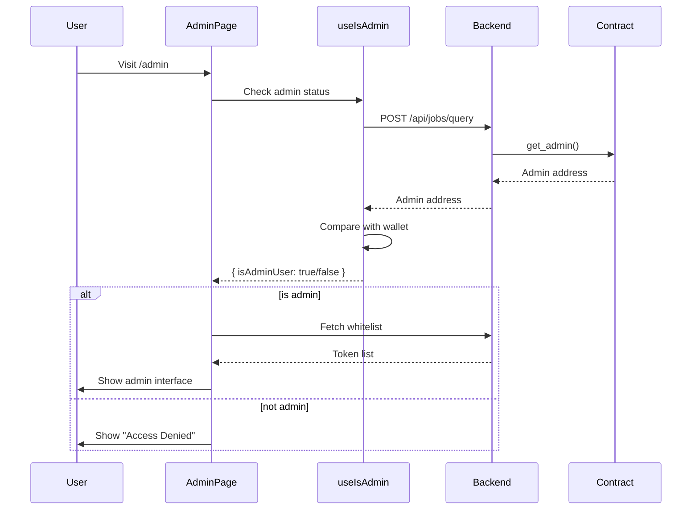
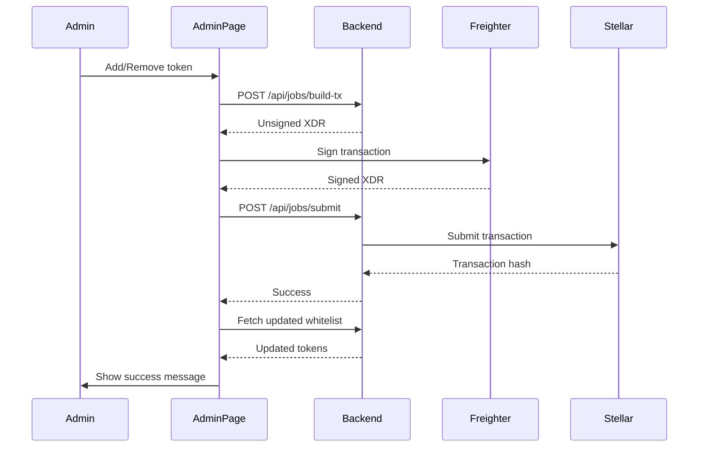

# Admin Page Implementation

## Overview

A dedicated admin page has been implemented to allow the contract admin to manage the token whitelist. The page includes admin access control, preventing non-admin users from accessing or using the functionality.

## Features Implemented

### 1. **Admin Access Control**
- ✅ Queries the smart contract to fetch the admin address via `get_admin` method
- ✅ Compares connected wallet with admin address
- ✅ Shows "Access Denied" screen for non-admin users
- ✅ Only loads whitelist data for verified admin users

### 2. **Token Whitelist Management**
- ✅ Displays current whitelisted tokens from backend endpoint
- ✅ Add new token form with contract address input
- ✅ Remove button for each token
- ✅ Empty state when no tokens are whitelisted
- ✅ Loading states for all async operations
- ✅ Error handling for network and backend failures

### 3. **Transaction Flow**
- ✅ Uses the same Freighter signing pattern as Create Job
- ✅ Calls backend `build-tx` and `submit` endpoints
- ✅ Shows phase-based loading indicators (Building → Signing → Submitting)
- ✅ Transaction status banners for success/error feedback
- ✅ Automatic whitelist refresh after successful transactions

### 4. **Navigation**
- ✅ Admin link appears in navbar only for admin users
- ✅ Hidden from non-admin wallets
- ✅ Accessible via `/admin` route

## Files Created/Modified

### New Files

#### `app/lib/admin.ts`
Utility functions for admin access control:
- `fetchAdminAddress()` - Queries contract for admin address
- `isAdmin()` - Checks if wallet is the admin

#### `app/hooks/useIsAdmin.ts`
React hook for checking admin status:
- Returns `{ loading, isAdminUser }`
- Handles async contract query
- Properly manages cleanup with AbortController

#### `__tests__/admin-page.test.tsx`
Comprehensive test suite covering:
- Wallet connection prompt
- Loading states
- Access denied for non-admins
- Admin form and whitelist display
- Empty states
- Error handling

#### `__tests__/admin.test.ts`
Unit tests for admin utilities:
- Admin address fetching
- Various response formats
- Error handling
- Admin checking logic

### Modified Files

#### `app/admin/page.tsx`
Complete admin page implementation:
- Admin access verification
- Token whitelist display
- Add/remove token functionality
- Transaction handling with proper states
- Responsive design with proper touch targets (44px minimum)

#### `app/components/Navbar.tsx`
- Added conditional Admin link
- Only shows when `useIsAdmin` returns `isAdminUser: true`

#### `README.md`
- Added `/admin` page to documentation

## Technical Implementation Details

### Admin Checking Flow



### Transaction Flow



## Backend Integration

The admin page expects the following backend endpoints:

### GET `/api/jobs/whitelisted-tokens?contractId={contractId}`
Returns current whitelisted tokens.

**Response format (either):**
```json
{
  "success": true,
  "data": ["CTOKEN1...", "CTOKEN2..."]
}
```
or
```json
["CTOKEN1...", "CTOKEN2..."]
```

### POST `/api/jobs/query`
Queries the contract for data.

**Request:**
```json
{
  "contractId": "C...",
  "method": "get_admin",
  "args": []
}
```

**Response (any of):**
```json
"GADMIN..."
```
or
```json
{
  "success": true,
  "data": "GADMIN..."
}
```
or
```json
{
  "result": "GADMIN..."
}
```

### POST `/api/jobs/build-tx`
Builds unsigned transaction for contract method.

**Request (Add Token):**
```json
{
  "contractId": "C...",
  "method": "add_whitelisted_token",
  "args": [
    { "type": "address", "value": "GADMIN..." },
    { "type": "address", "value": "CTOKEN..." }
  ],
  "sourceAddress": "GADMIN..."
}
```

**Request (Remove Token):**
```json
{
  "contractId": "C...",
  "method": "remove_whitelisted_token",
  "args": [
    { "type": "address", "value": "GADMIN..." },
    { "type": "address", "value": "CTOKEN..." }
  ],
  "sourceAddress": "GADMIN..."
}
```

**Response:**
```json
{
  "xdr": "AAAAAgAAAA..."
}
```

### POST `/api/jobs/submit`
Submits signed transaction.

**Request:**
```json
{
  "signedXdr": "AAAAAgAAAA..."
}
```

**Response:**
```json
{
  "hash": "abc123...",
  "txHash": "abc123...",
  "transactionHash": "abc123..."
}
```

## Smart Contract Requirements

The admin page requires the following contract methods:

### `get_admin() -> Address`
Returns the contract admin address.

### `add_whitelisted_token(admin: Address, token: Address)`
Adds a token to the whitelist.
- Must verify caller is admin
- Must emit appropriate events

### `remove_whitelisted_token(admin: Address, token: Address)`
Removes a token from the whitelist.
- Must verify caller is admin
- Must emit appropriate events

## User Experience

### For Admin Users
1. Connect wallet
2. See "Verifying admin access..." loading state
3. Admin page loads with:
   - Add token form at top
   - Current whitelist below
   - Remove button per token
4. Add token:
   - Enter contract address
   - Click "Add to Whitelist"
   - Sign in Freighter
   - See success message
   - Token appears in list
5. Remove token:
   - Click "Remove" on any token
   - Sign in Freighter
   - See success message
   - Token disappears from list

### For Non-Admin Users
1. Connect wallet
2. See "Verifying admin access..." loading state
3. See "Access Denied" message with:
   - 🔒 Lock icon
   - Clear explanation
   - Professional styling

### For Disconnected Users
1. See prompt to connect wallet
2. No admin check performed

## Accessibility

- ✅ All interactive elements have proper labels
- ✅ Form inputs have associated `<label>` elements
- ✅ Error messages use `role="alert"`
- ✅ Loading states have descriptive text
- ✅ Touch targets meet 44px minimum size
- ✅ Focus indicators on all interactive elements
- ✅ Semantic HTML structure

## Responsive Design

- ✅ Mobile-first approach with `px-6` padding
- ✅ `max-w-xl` container for comfortable reading width
- ✅ Token addresses truncate with `truncate` class
- ✅ `min-w-0` on flex items for proper truncation
- ✅ Buttons use `min-h-11` (44px) for touch targets
- ✅ Stack layout on small screens
- ✅ Proper spacing with Tailwind utilities

## Security Considerations

1. **Backend Verification**: The backend MUST verify the caller is admin before executing add/remove operations. The frontend check is for UX only.

2. **Contract-Level Security**: The smart contract MUST enforce admin-only access for whitelist modifications.

3. **No Hardcoded Admin**: Admin address is fetched from contract, not hardcoded.

4. **Transaction Signing**: All transactions require user approval in Freighter wallet.

## Testing

Two test suites have been created:

### `__tests__/admin-page.test.tsx`
Tests the AdminPage component:
- Wallet connection states
- Admin verification states
- Access denied for non-admins
- Admin UI rendering
- Whitelist display
- Error handling

### `__tests__/admin.test.ts`
Tests admin utility functions:
- Admin address fetching
- Response format handling
- Error handling
- Admin status checking

Run tests with:
```bash
npm test admin
```

## Future Enhancements

Potential improvements:
1. Token metadata display (symbol, name) alongside addresses
2. Search/filter for large token lists
3. Bulk add/remove operations
4. Transaction history/audit log
5. Token verification (check if address is valid contract)
6. Confirmation dialogs for remove operations
7. Real-time updates via WebSocket

## Acceptance Criteria ✓

- [x] Admin can add tokens end to end
- [x] Admin can remove tokens end to end
- [x] Non-admin wallets cannot access or use this page
- [x] Page shows current whitelisted tokens
- [x] Form to add new token address
- [x] Remove button per token
- [x] Sign and submit via Freighter (same pattern as Create Job)
- [x] Only shows page/link if connected wallet matches admin address
- [x] Professional UI consistent with app design
- [x] Proper loading and error states
- [x] Responsive design
- [x] Accessibility compliant
- [x] Comprehensive test coverage
