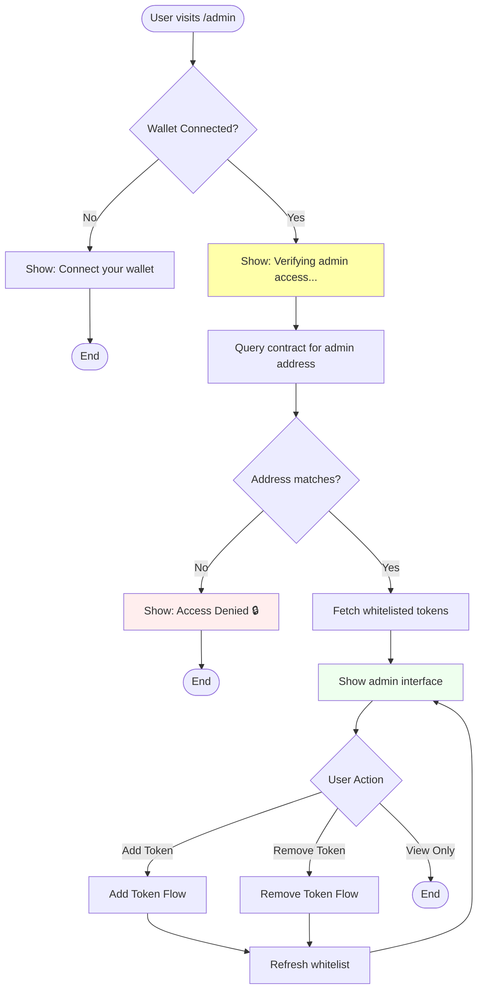
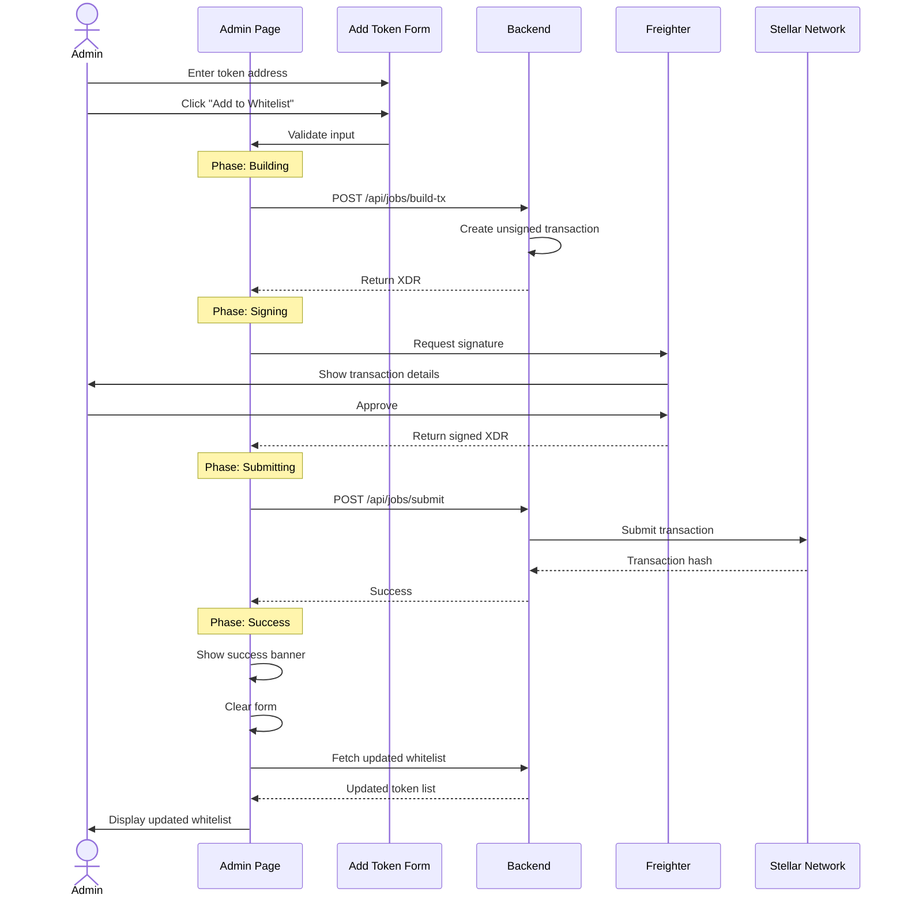
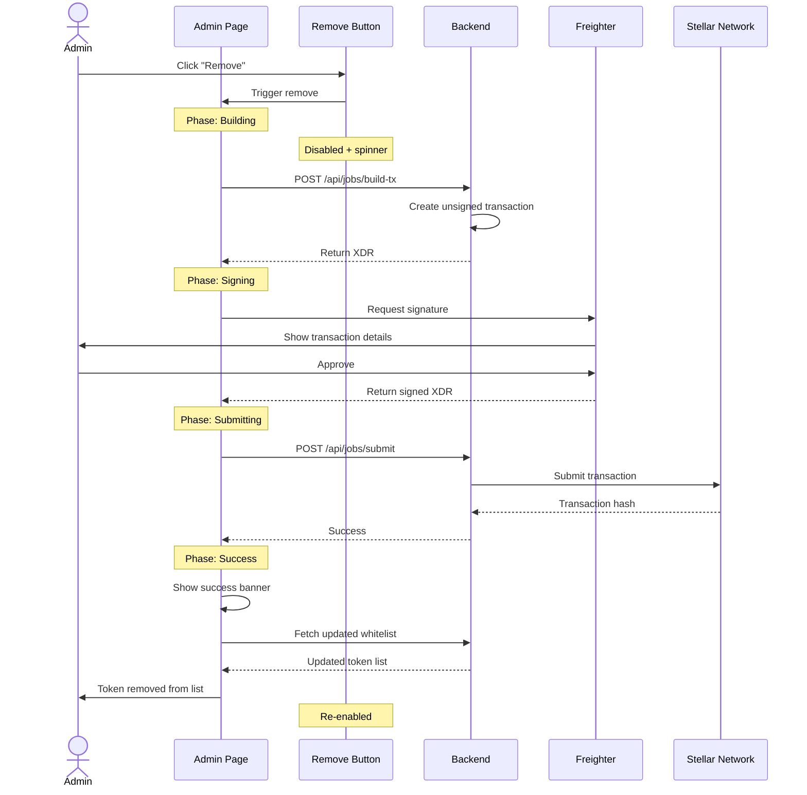
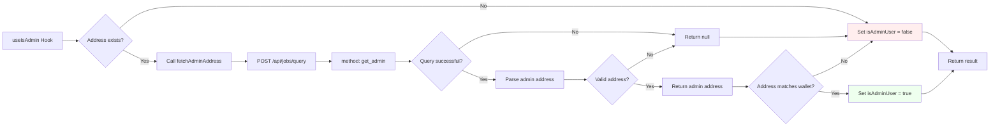
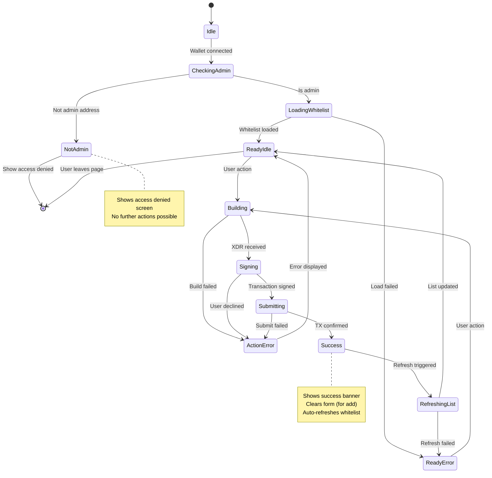
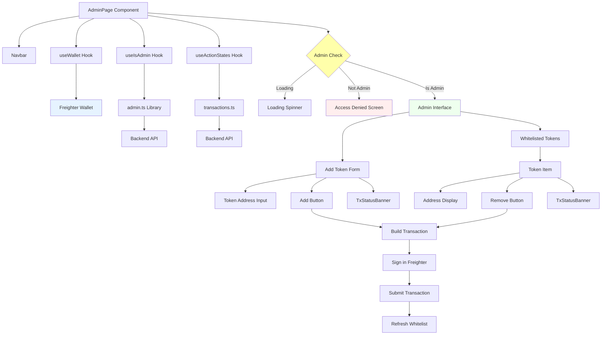
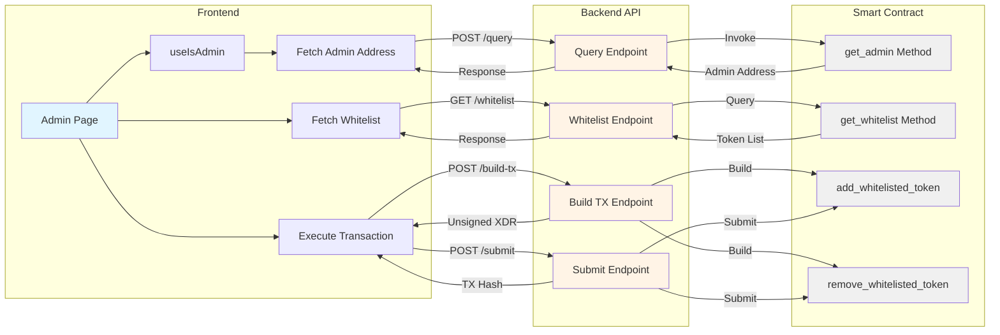
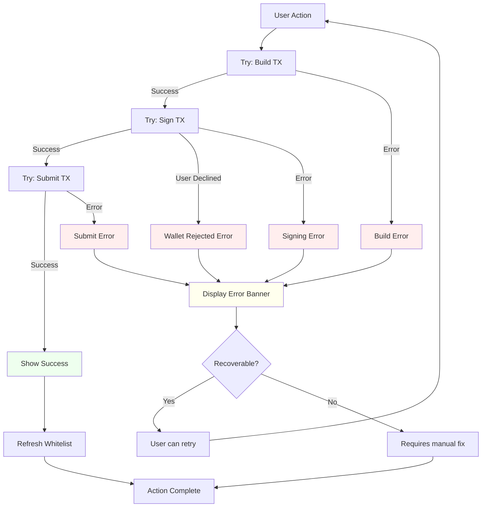

# Admin Page Flow Diagrams

## Overall Page Flow

## Add Token Flow

## Remove Token Flow

## Admin Check Flow

## State Management

## Component Architecture

## Data Flow

## Error Handling

## Notes

- All diagrams use consistent color coding:
  - 🟢 Green: Success/Admin states
  - 🔴 Red: Error/Denied states
  - 🟡 Yellow: Loading/Processing states
  - 🔵 Blue: User interface elements
  - ⚪ Gray: Backend/Contract components

- Flows are designed to be fault-tolerant with proper error handling
- All state transitions are explicit and traceable
- User feedback is provided at every step
